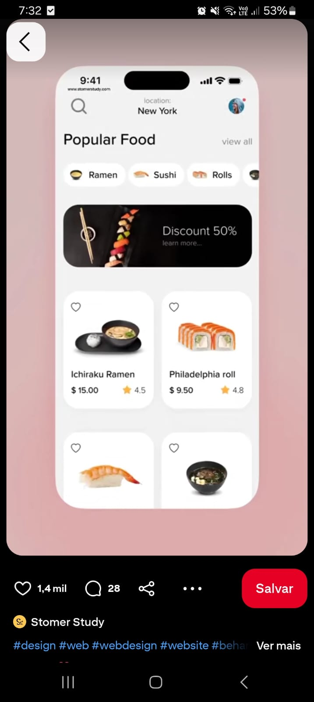

#  Restaurant App

Aplicativo desenvolvido em **Kotlin** usando **Android Studio**.
Este foi o meu primeiro projeto no Android Studio, criado com o objetivo de estudar a construção de interfaces, organização de código e boas práticas no desenvolvimento mobile.

O design foi inspirado em uma **ilustração encontrada no Pinterest**, mas com alterações no layout, cores e disposição de elementos para servir como base de estudo e treino de recriação.

##  Tópicos

- [Descrição do Projeto](#descricao)
- [Screenshots](#screenshots)
- [Tecnologias e Ferramentas](#tecnologias)
- [Licença](#licença)
- [Contato](#contato)

<h2 id="descricao">
   Descrição Do Projeto
</h2>

O **Restaurant App** simula uma tela inicial de um aplicativo de delivery, apresentando pratos japoneses populares, preços e avaliações.

O projeto foi feito para **treinar Layouts no Jetpack Compose, uso de imagens, scroll horizontal e vertical**, além de estilização de **componentes**.

Ele não possui backend ou integração com APIs todo o conteúdo mostrado é mockado (dados fictícios), servindo apenas para **estudo de UI**.

<h2 id="screenshots">
   Screenshots
</h2>

  
  

<h2 id="tecnologias">
   Tecnologias e Ferramentas
</h2>

- Linguagem: **Kotlin**
- IDE: **Android Studio**
- Framework: **Jetpack Compose**

<h2 id="licenca">
   Licença
</h2>

Este projeto não possui uma licença definida.  
Sinta-se livre para estudar, adaptar ou reutilizar o código como quiser.

<h2 id="contato">
   Contato
</h2>

Para dúvidas, sugestões ou parcerias:

- **Nome**: Glauedson Carlos Rodrigues  
- **Email**: gluedson18s@gmail.com  
- **Linkedin**: [Glauedson Carlos](https://www.linkedin.com/in/glauedson-carlos-89875b258/)
